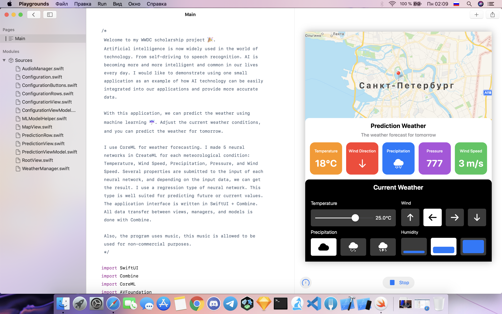

# WWDC2020
Project for the Swift Student Challenge

# Welcome to my WWDC scholarship project. 

Artificial intelligence is now widely used in the world of technology. From self-driving to speech recognition. AI is becoming more and more intelligent and common in our lives every day. I would like to demonstrate using one small application as an example of how AI technology can be easily integrated into our applications and provide more accurate data. 

With this application, we can predict the weather using machine learning. Adjust the current weather conditions, and you can predict the weather for tomorrow. 

I use CoreML for weather forecasting. I made 5 neural networks in CreateML for each meteorological condition: Temperature, Wind Direction, Precipitation, Pressure, and Wind Speed. Several properties are submitted to the input of each neural network, and depending on the input data, we can get the result. I use a regression type of neural network. This type is well suited for predicting future or current values. The application interface is written in SwiftUI + Combine. All data transfer between views, managers, and models is done with Combine. 

Also, the program uses music, this music is allowed to be used for non-commercial purposes.
